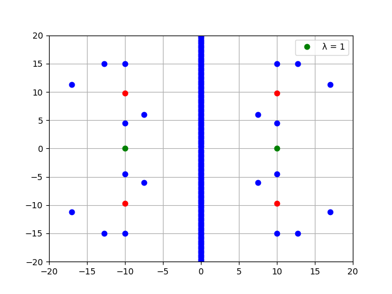

## Especificaciones

Hacer un programa que grafique todos los puntos en un área determinada donde se produzcan interferencias constructivas y destructivas a partir de dos fuentes.
- Los puntos que correspondan a una interferencia constructiva deben marcarse con azul.
- Los puntos que correspondan a una interferencia destructiva deben marcarse con rojo.
- Los puntos que representan el origen de las ondas (los verdes) no deben taparse.

Saquen foto de tres patrones distintos. Luego, hagan un `README.md` con lo siguiente:

```markdown
# Interferencia

Alumno: Nombre y apellido
Curso: Curso
Materia: Telecomunicaciones I

[imagen 1]

[imagen 2]

[imagen 3]
```

## Consideraciones

- Recuerden que para una interferencia **constructiva** se tiene que verificar:

<div align="center">
  
</div>

- Para una interferencia **destructiva** se verifica:

<div align="center">
  
</div>

- Algo como esto debe quedar:



- Hay operadores de Python que les pueden servir para determinar si el resto de una división es cero entre otros. [Link](https://www.w3schools.com/python/python_operators.asp) para verlos.

## Como entregar

- Archivos para subir: `README.md`, `interferencia.py` y las tres fotos que sacaron.
- Nombre de la rama: `teleco1/2021/optica/interferencia`.
